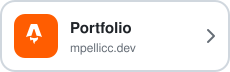
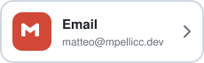
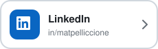
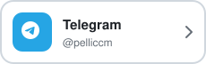

# Hi there! I'm **Matteo** 😊

I am a **full-stack developer** with a leaning towards **back-end development**, currently pursuing a degree in **Computer Science and Engineering** at the University of Bologna in Cesena.

## 👨🏻‍💻 [mpellicc.dev](https://mpellicc.dev)
A personal portfolio site built with **Astro**, **CSS**, and **TypeScript**.

## 🚀 What I'm up to

- 👨🏻‍💻 Working [@DMA](https://github.com/DMA-digital-for-business) as a **full-stack developer**.
- 🐍 Exploring **Python** and **AI** for personal projects like [@fantaformazionibot](https://t.me/fantaformazionibot).

## 🎮 Beyond Coding

When I'm not in front of lines of code, you can find me:

- 🎮 Diving into **Video Games**.
- ⛩️ Catching up on the latest **Anime & Manga**.
- 🏋️‍♂️ Training at the **Gym** to stay active.

## 🛠️ Work Environment

    

## ⚙️ Skills & Stats

    

 

    
    

## 📫 Get in touch

**Have an idea, a project, or just want to say hi? My inbox is always open.** 👋

### Version A: badges

&nbsp;&nbsp;
&nbsp;&nbsp;
&nbsp;&nbsp;

### Version B: custom cards

<a href="https://mpellicc.dev"><picture><source media="(prefers-color-scheme: dark)" srcset="assets/contact/portfolio-dark.svg"></picture></a>&nbsp;
<a href="mailto:matteo@mpellicc.dev"><picture><source media="(prefers-color-scheme: dark)" srcset="assets/contact/email-dark.svg"></picture></a>&nbsp;
<a href="https://www.linkedin.com/in/matpelliccione/"><picture><source media="(prefers-color-scheme: dark)" srcset="assets/contact/linkedin-dark.svg"></picture></a>&nbsp;
<a href="https://t.me/pelliccm"><picture><source media="(prefers-color-scheme: dark)" srcset="assets/contact/telegram-dark.svg"></picture></a>

